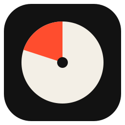
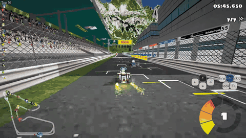
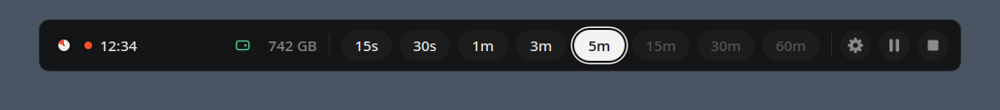
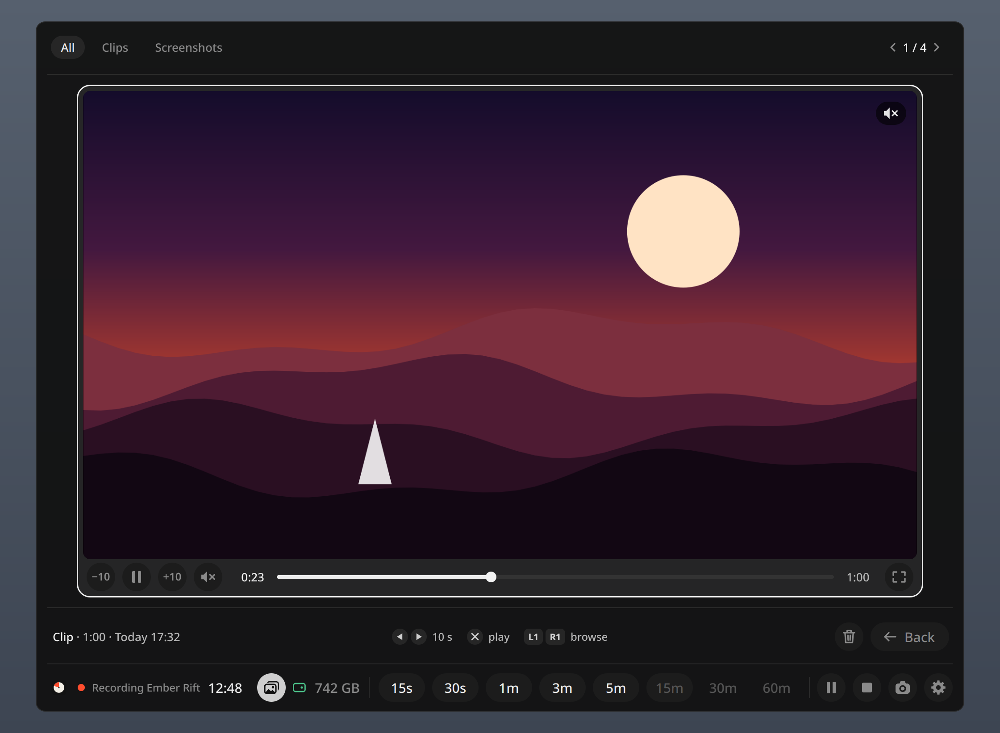
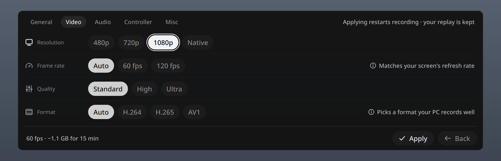
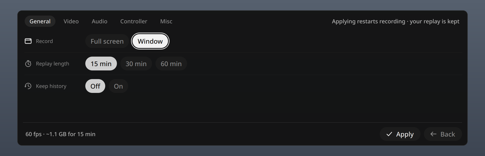
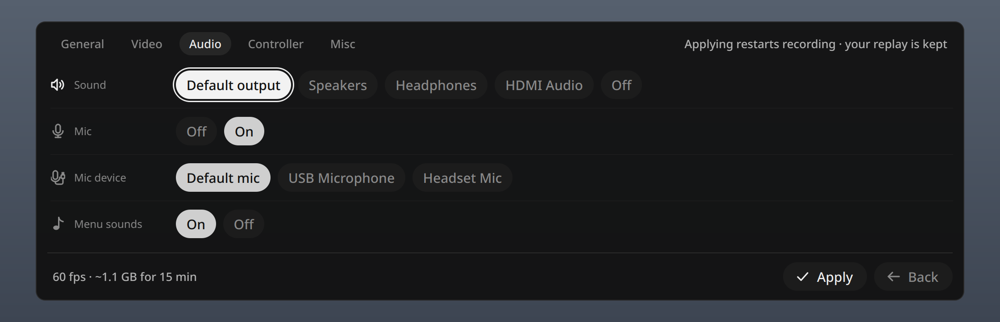
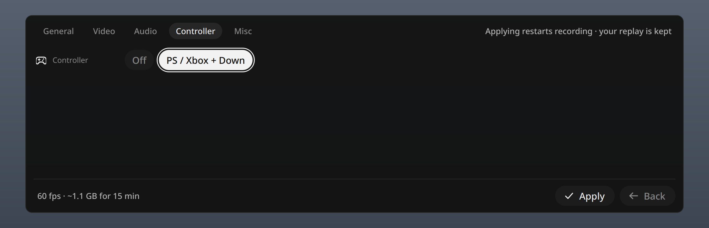
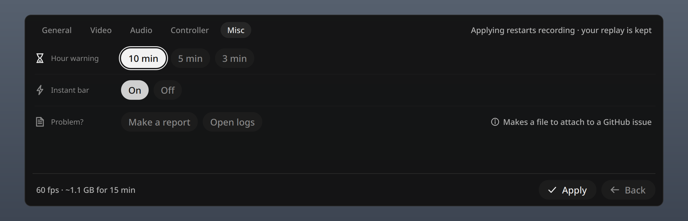

<div align="center">



# Momento

**The lite way to record on Linux.**

Instant replay and screenshots. Made for games, handy for anything. One line to install.

[](LICENSE)
[](#install)
[](#using-it)

</div>

<p align="center"><br>
<sub>Game footage: SuperTuxKart by kimden STK, <a href="https://creativecommons.org/licenses/by/3.0/">CC BY 3.0</a>, edited.</sub></p>

<p align="center"></p>

Momento quietly keeps the last 15 minutes of your game (up to 60). Something great happens? Press **Super + Shift + G** (or **PS / Xbox + D-pad Down**), pick how far back, and the clip is in `~/Videos/Momento` seconds later.

## Why Momento

| | |
|---|---|
| **Any game** | Steam, non-Steam, emulators, browser games, GeForce NOW and other cloud gaming. |
| **Save it after it happened** | Momento keeps the last 15, 30 or 60 minutes. Save 15s, 30s, 1m, 3m, 5m, 15m, 30m or 60m of it. |
| **Saves in the background** | The bar closes at once. A sound and a notification tell you when the MP4 is ready. Plays and uploads anywhere. |
| **Matches your screen** | Records at 120 fps on a 120 Hz screen and 60 fps on a 60 Hz one, without you setting anything. |
| **Just the game** | Record one window, so chats and pop-ups stay out of your clips. Or the full screen. |
| **Screenshots** | One button. The bar gets out of the way first. |
| **Gallery** | Watch, browse and delete your clips and screenshots right in the bar. |
| **Made for controllers** | Open, pick and save without touching a mouse. Great on handhelds. |
| **Lite** | About 150 MB of memory, even with 60 minutes of replay. Quick to set up. |
| **Local only** | No account. Nothing is uploaded. |

## Install

Copy this into a terminal and press Enter. It shows you what it will install and asks first.

```bash
curl -fsSL https://raw.githubusercontent.com/mehulchachada/momento/main/install.sh | bash
```

It installs the latest Momento for your user and starts it. That's it.

| Your system | What to do |
|---|---|
| Bazzite, Aurora, Bluefin | The one-liner. Nothing extra needed. |
| Fedora | The one-liner, or the `.rpm` from the [Releases page](https://github.com/mehulchachada/momento/releases/latest). |
| Arch, CachyOS, EndeavourOS, Manjaro | The one-liner, or the Arch package from the [Releases page](https://github.com/mehulchachada/momento/releases/latest). |
| Ubuntu 25.04+, Debian 13+ | The one-liner, or the `.deb` from the [Releases page](https://github.com/mehulchachada/momento/releases/latest). |
| Ubuntu 24.04, Pop!_OS, Mint | The one-liner.\* |
| openSUSE Tumbleweed | The one-liner. |
| SteamOS | Not yet. |

\* On Ubuntu 24.04 everything works except playing clips in the gallery, which needs Ubuntu 25.04 or newer.

Installed a package from the Releases page? Run this once so Momento starts when you log in:

```bash
systemctl --user enable --now momento.service
```

If your system needs one extra step for the smoothest recording, the installer tells you exactly what to run.

<details><summary><b>Install the parts yourself, update, or try the newest code</b></summary>

```bash
curl -fsSL https://raw.githubusercontent.com/mehulchachada/momento/main/install.sh | bash -s -- --check     # list what your system is missing
curl -fsSL https://raw.githubusercontent.com/mehulchachada/momento/main/install.sh | bash -s -- --no-deps   # install Momento, skip the system parts
curl -fsSL https://raw.githubusercontent.com/mehulchachada/momento/main/install.sh | bash -s -- --dev       # the newest test version
~/.local/share/momento/install.sh --update                                                                   # update to the latest release
```

`--check` names the exact packages for your system. Install them with your package manager, then use `--no-deps`.
</details>

## First launch

1. Start your game and press **Super + Shift + G**. The bar opens.
2. Press **play**. Your desktop asks what to share, like when you share your screen on Discord.
3. Pick **your game's window**, tick **Remember** or **Allow restoring** if you see it, and click **Share**.

Momento now records in the background until you stop it or the game closes.

## Using it

**Keyboard and mouse**

| Do this | What happens |
|---|---|
| **Super + Shift + G** | Opens or closes the bar |
| Click a length (or **1**–**8**) | Saves that much, ending right now. The bar closes right away; a sound and a notification tell you when the clip is ready |
| Camera button | Takes a screenshot |
| **P** or pause button | Pauses or resumes. What you have can still be saved |
| Stop button | Stops recording (asks first) |
| **G** or gallery button | Opens the [gallery](#gallery) |
| **S** or gear | Opens [settings](#settings) |
| **Esc** | Closes the bar without saving |

The **Super** key is the Windows / start-menu key.

While a clip saves, a small saving icon shows in the bar. Want another one right away? Save again: saves wait their turn.

**With a controller**

Hold **PS** (or **Xbox** / **Home**) and press **D-pad Down** to open or close the bar. Press PS first. Your game doesn't see the D-pad press.

| Button | In the bar |
|---|---|
| **D-pad** or left stick | Move around |
| **A** | Save the selected length, or choose |
| **B** | Back, or close the bar |
| **X** | Pause or resume |
| **Y** | Settings |
| **LB / RB** | Jump between the gallery button, the lengths and the buttons |

Buttons go by position, so on a PlayStation controller A is ✕, B is ○, X is □ and Y is △. The hints on screen show your own controller's symbols.

> **Steam Gaming Mode:** works there too. Turn off Steam's own game recording, or give it a different shortcut.

**From a terminal** (handy for your own key or button binds)

```bash
momento save 30s      # save without opening the bar (15s, 1m, 5m, 90s...)
momento screenshot    # save a picture
momento status        # is it recording, and how much is kept
```

## Gallery

<p align="center"></p>

Press **G**, the gallery button, or move to it with your controller. It opens right above the bar, and clips start playing, muted.

It has three rows. Move between them with **up / down**; a white ring shows where you are.

| Row | What's in it |
|---|---|
| Top | Filters: **All**, **Clips**, **Screenshots** |
| Middle | The clip or screenshot, with its controls |
| Bottom | **Delete** and **Back** |

| Do this | Controller | Keyboard |
|---|---|---|
| Browse | **LB / RB** | **PgUp / PgDn** |
| Skip 10 seconds (on a clip) | **◀ ▶** | **← →** |
| Play or pause a clip | **A** (✕) | **Space** |
| Sound on or off | **X** (□) | **M** |
| Full screen | **Y** (△) | **F** |
| Delete | the **Delete** button | **Delete** |
| Back to the bar | **B** (○) | **Esc** |

- **Delete** asks first, and the file goes to the Trash.
- The hints at the bottom show your own controller's symbols, and change with where you are.
- In **Full screen** mode, recording pauses while the gallery is open so it doesn't end up in your clips, then picks up again.

## Settings

<p align="center"></p>

Open with the **gear** (**S**, or **Y** on a controller), pick what you want, then **Apply**. Your replay is kept.

| Tab | Setting | Choices (default in bold) |
|---|---|---|
| **General** | Record | Full screen, **Window**. The bar shows what it's recording, like *Recording Ember Rift*. |
| | Replay length | **15 min**, 30 min, 60 min. How far back you can save. Clip lengths longer than this are greyed out. |
| | Keep history | **Off**: stopping clears the replay. On: it's kept, and every full replay is also saved to Videos. |
| **Video** | Resolution | 480p, 720p, **1080p**, Native (your screen's shape, up to 1080p). 480p: smallest files, softest picture. |
| | Frame rate | **Auto** matches your screen (120 on a 120 Hz screen, 60 on a 60 Hz one). Smoothest for your game. Or always 60 fps or 120 fps. |
| | Quality | **Standard**, High, Ultra. Higher is sharper and takes more space. |
| | Format | **Auto** picks one your PC records well: H.264 on most PCs. Or pick one yourself: |
| | | H.264: plays everywhere. |
| | | H.265: smaller files. Some older devices can't play it. |
| | | AV1: smoothest on newer hardware. Some older devices can't play it. |
| **Audio** | Sound | Your default output, a specific device, or Off |
| | Mic | **Off**, On (plus which mic) |
| | Menu sounds | **On**, Off. Soft sounds as you use the bar. They may be heard in a clip saved at that moment. |
| **Controller** | Controller | **PS / Xbox + Down**, Off |
| **Misc** | Hour warning | **10**, 5 or 3 minutes' notice before your replay is full |
| | Instant bar | **On**: the bar opens instantly (about 100 MB). Off: saves that memory. |
| | Problem? | **Make a report** for a [GitHub issue](#something-wrong); **Open logs** shows the log files |

Clips are always MP4. Formats your PC can't record are greyed out. If a format stops working, Momento switches to another by itself and tells you.

<details><summary><b>See every tab</b></summary>

<p align="center"></p>
<p align="center"></p>
<p align="center"></p>
<p align="center"></p>
</details>

**Disk space** for a full replay at 1080p (Momento needs this plus 1 GB free to start). Frame rate **Auto** records at 60 or 120 fps, to match your screen:

| Replay length | Frame rate | Standard (default) | High | Ultra |
|---|---|---|---|---|
| 15 min (default) | 60 fps | **1.1 GB** | 1.7 GB | 2.8 GB |
| 15 min (default) | 120 fps | **1.7 GB** | 2.5 GB | 4.3 GB |
| 60 min | 60 fps | 4.5 GB | 6.8 GB | 11.2 GB |
| 60 min | 120 fps | 6.8 GB | 9.9 GB | 17.1 GB |

The replay never grows past its length. The free space in the bar turns yellow, then red, when it's getting tight, and you get a notification.

<details><summary><b>More settings (for tinkerers)</b></summary>

Every setting also works from a terminal: `momento set fps auto`, `momento set format av1`. See them all with `momento settings`.

A few extras live only in `~/.config/momento/config.toml`. Restart Momento after editing it: `systemctl --user restart momento.service`.

| Setting | Key | Default |
|---|---|---|
| Clip folder | `[output] dir` | your Videos folder + `/Momento` |
| Keyboard shortcut | `[hotkey] trigger` | `LOGO+SHIFT+g` (Super + Shift + G) |
</details>

## Tested on

Momento 1.0 was tested on this setup:

| | |
|---|---|
| Device | ASUS ROG Ally (Z1 Extreme), 120 Hz screen |
| System | Bazzite, KDE Plasma 6.7 |
| Game | Rematch, Full screen |
| Settings | 1080p, Frame rate Auto (120 fps), Standard, H.264 |

| What we checked | Result |
|---|---|
| Game FPS while recording | About 3–5 FPS lower, with only occasional small dips |
| Recording at 60 fps on the 120 Hz screen | More stutter than 120 fps. Auto avoids this by matching your screen. |
| Momento's memory | About 150 MB while recording |
| Steam Gaming Mode | Works |

| Not tested yet |
|---|
| NVIDIA, Intel and other AMD graphics |
| Steam Deck and other handhelds |
| GNOME, Hyprland and other desktops |
| Other distros |

Tried it? [Tell us how it runs](https://github.com/mehulchachada/momento/issues/new?template=how-it-runs.yml). It takes 2 minutes.

## How it compares

| | **Momento** | Steam recording | OBS replay | GPU Screen Recorder |
|---|:---:|:---:|:---:|:---:|
| Works with any game | ✓ | Steam games only | ✓ | ✓ |
| Pick the length when you save | 15 s – 60 min | Trim on a timeline | Whole replay | Whole, 1 or 10 min |
| Memory for an hour at 1080p | ~150 MB | Kept on disk | ~6.8 GB | ~6.8 GB (RAM mode) |
| Replay kept after a restart | ✓ | Not documented | ✗ | ✗ (RAM mode) |
| Controller-friendly overlay | ✓ | ✓ | ✗ | ✓ |
| Steam Gaming Mode | ✓ | ✓ | Not designed for it | Not documented |
| Longest replay | 60 min | 120 min | 6 h | 24 h |

## Good to know

- **Notifications keep you posted**: when a clip or screenshot is saved, a few minutes before your replay is full, and when disk space runs low.
- **Screenshots come from the recording**, so they work while Momento is recording (not paused or stopped).
- **With Keep history off, stopping clears your replay.** So does the game closing. Save first.
- **Full screen records everything**, including the bar and notifications. Use **Window** to keep them out.
- **Any sound you hear is recorded**, like Discord or music, unless you pick another output under **Sound**.
- **"Recording Window" instead of the game's name?** Some desktops don't share the name. Recording works the same.
- **Steam may react to the PS / Xbox button too.** If it gets in the way, turn the controller shortcut off in settings and use the keyboard.
- **On GNOME**, use borderless or windowed fullscreen so the bar can show over your game.

## FAQ

<details><summary><b>Where are my clips and screenshots?</b></summary>

Clips are in `~/Videos/Momento`, screenshots in `~/Videos/Momento/Images`. The notification after each save shows the exact file, and the [gallery](#gallery) shows them all.
</details>
<details><summary><b>Does it lower my FPS?</b></summary>

A little. On our ROG Ally it was about 3–5 FPS in Rematch at 1080p with Frame rate Auto and Standard quality, with only occasional small dips. See [Tested on](#tested-on). Different PC? [Tell us how it runs](https://github.com/mehulchachada/momento/issues/new?template=how-it-runs.yml).
</details>
<details><summary><b>Can I use it outside games?</b></summary>

Yes. Record one window or the whole screen: a bug you just hit, the last minutes of a call or a stream. Everything works the same.
</details>
<details><summary><b>Does it work in Steam Gaming Mode?</b></summary>

Yes. Turn off Steam's own game recording, or give it a different shortcut.
</details>
<details><summary><b>Why did recording stop?</b></summary>

In Window mode, recording stops when the game closes. It also stops if your disk gets almost full. A notification tells you which. Press play in the bar to start again.
</details>
<details><summary><b>My controller doesn't open the bar</b></summary>

Press **PS** / **Xbox** / **Home** and **D-pad Down** together (PS / Xbox first is easiest). Check that **Controller** isn't Off in settings. To see what Momento gets, run `momento controller --watch` and press the buttons.
</details>
<details><summary><b>Super + Shift + G does nothing</b></summary>

Check that `momento status` says it's running. On KDE, look for Momento under *System Settings → Keyboard → Shortcuts*, where you can also change the key. On other desktops, add a custom shortcut that runs `momento overlay`.
</details>
<details><summary><b>My clip is black or shows the wrong thing</b></summary>

The wrong thing was picked when sharing. In Window mode, press stop, then play, and pick again. In Full screen mode, reset it:

```bash
rm ~/.local/state/momento/portal_token
systemctl --user restart momento.service
```
</details>
<details><summary><b>My clip has no sound</b></summary>

Momento records your **default** sound output. If the game plays through another device, make that the default or pick it under **Sound** in settings.
</details>
<details><summary><b>Will it wear out my SSD?</b></summary>

At the default settings it writes about 4.5 GB per hour of play (6.8 GB at 120 fps), a small part of a typical SSD's rated life. Pick a lower resolution to write less.
</details>
<details><summary><b>Running <code>momento</code> starts a different program</b></summary>

An unrelated tool has the same name. This app lives in `~/.local/bin/momento`: put `~/.local/bin` first in your `PATH`, or use the full path. The shortcut and app menu are not affected.
</details>

## Something wrong?

1. Make a report: in the bar, **Settings → Misc → Make a report**, or run `momento report`. It saves a file in your Home folder, with nothing personal in it.
2. [Tell us what happened](https://github.com/mehulchachada/momento/issues/new?template=problem.yml) and attach that file.
3. To look yourself, run `momento logs`.

Logs are in `~/.local/state/momento/logs/`.

## Uninstall

```bash
~/.local/share/momento/install.sh --uninstall   # removes Momento, keeps settings and clips
~/.local/share/momento/install.sh --purge       # also removes settings and the replay
```

Your saved clips and screenshots are never deleted.

## Roadmap

- Testing and support on more devices and systems, with your help
- Your own controller shortcut (any two buttons)
- 1440p and 4K recording
- Microphone on its own audio track
- A richer gallery:
  - Mark favourite clips
  - Folders and playlists to organise them
  - Trim long clips to just the good part
  - Quick share to Discord, YouTube or Steam chat

## Contributing

Bug reports, testing and pull requests are welcome. See [CONTRIBUTING.md](CONTRIBUTING.md).

## License

[MIT](LICENSE) © 2026 Momento contributors
