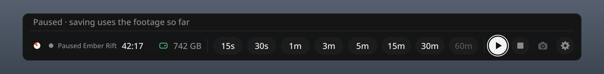
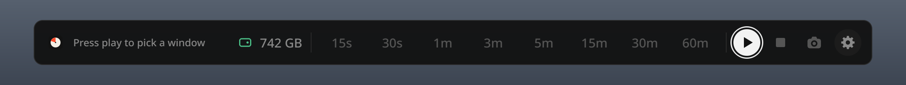
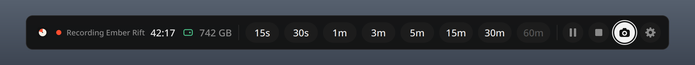

<div align="center">


# Momento

**Never miss the moment.**

Instant replay and screenshots for Linux. Made for games, handy for anything on your screen.<br>
Momento keeps the last hour of your game in the background. Something great happens? Save it.

[](LICENSE)
[](#install)
[](#install)
[](#using-a-controller)
[](#faq)

</div>

---

<p align="center"></p>

Press play once and Momento records in the background. When something worth keeping happens, press **Super + Shift + G** (or hold **View + Menu** on your controller), pick how far back to go, and the clip is in `~/Videos/Momento` a few seconds later.

## Features

- **Any game.** Steam, non-Steam, emulators, browser games, GeForce NOW and other cloud gaming.
- **Save it after it happened.** Always-on replay of up to 60 minutes. Keep the last 15s, 30s, 1m, 3m, 5m, 15m, 30m or the full hour.
- **MP4 in seconds.** No re-encoding: a 1-minute clip is ready in about 3 seconds. Plays and uploads anywhere.
- **Just the game.** Window mode (the default) records only your game, so the bar, chats and notifications stay out of your clips. The bar shows what it's recording: *Recording Ember Rift*. Prefer everything? Switch to Full screen.
- **Screenshots.** One button. The bar gets out of the way first, then the picture lands in `~/Videos/Momento/Images`.
- **Made for controllers.** Hold View + Menu to open the bar, move with the D-pad, save with A. No mouse needed on a handheld.
- **Opens instantly.** The bar is kept ready, so it's on screen the moment you ask.
- **Pause and stop** whenever you want.
- **Keep history, if you want it.** Keep your replay after you stop or quit the game, and get every full hour saved as a video.
- **A heads-up before the hour.** A notification 10, 5 or 3 minutes before the start of your session starts being replaced.
- **Never fills your disk.** Momento checks free space and tells you early when it's getting tight.
- **Light.** Your graphics card does the heavy lifting. About 150 MB of memory for a full hour of replay.
- **Local only.** Nothing is uploaded. No account.

## How it compares

| | **Momento** | Steam recording | OBS replay |
|---|:---:|:---:|:---:|
| Works with any game | ✓ | Steam games only | ✓ |
| Pick the length when you save (15 s – 60 min) | ✓ | Trim on a timeline | Whole buffer only |
| Controller-friendly overlay | ✓ | ✓ | ✗ |
| Memory for an hour of replay | ~150 MB | Kept on disk | ~6.8 GB |
| Keyboard shortcut on Wayland | ✓ | Steam shortcuts | Needs a plugin |
| Steam Gaming Mode | Records; bar coming | ✓ | ✗ |

More detail, including GPU Screen Recorder: [docs/COMPARISON.md](docs/COMPARISON.md).

## Install

```bash
curl -fsSL https://raw.githubusercontent.com/mehulchachada/momento/main/install.sh | bash
```

Or clone the repo and run `./install.sh`. It installs any missing system packages (it shows you the command and asks first), installs Momento for your user and starts it.

| Distro | Notes |
|---|---|
| Bazzite, Aurora, Bluefin | Nothing extra. Everything is already in the system. |
| Fedora | The installer handles it. AMD needs RPM Fusion for GPU encoding. |
| Arch, CachyOS, EndeavourOS, Manjaro | The installer handles it. |
| Ubuntu 24.04+, Debian 13+, Pop!_OS, Mint | The installer handles it. |
| openSUSE Tumbleweed | The installer handles it. Add Packman for GPU encoding. |
| SteamOS | Not yet. A Flatpak is coming. |

To install the packages yourself, use the list for your distro, then run `./install.sh --no-deps`.

<details><summary><b>Fedora Workstation / KDE</b></summary>

```bash
sudo dnf install python3-gobject gstreamer1 gstreamer1-plugins-base python3-dbus python3-pyside6 pipewire-gstreamer gstreamer1-plugins-good gstreamer1-plugins-bad-free gstreamer1-plugin-libav ffmpeg-free gstreamer1-plugin-openh264 layer-shell-qt pulseaudio-utils
```
GPU encoding: AMD needs [RPM Fusion](https://rpmfusion.org/Configuration) and `mesa-va-drivers-freeworld`. Intel: `libva-intel-media-driver`. NVIDIA: the proprietary driver. On Silverblue / Kinoite these packages must be layered with `rpm-ostree install`, which slows every system update.
</details>
<details><summary><b>Arch, CachyOS, EndeavourOS, Manjaro</b></summary>

```bash
sudo pacman -S --needed python-gobject gstreamer gst-plugins-base-libs python-dbus pyside6 gst-plugin-pipewire gst-plugins-good gst-plugins-bad gst-plugin-va gst-libav gst-plugins-ugly ffmpeg layer-shell-qt libpulse
```
GPU encoding: AMD works out of the box. Intel: `intel-media-driver`. NVIDIA: the proprietary driver.
</details>
<details><summary><b>Ubuntu, Debian, Pop!_OS, Mint</b></summary>

```bash
sudo apt install python3-gi gir1.2-gstreamer-1.0 gir1.2-gst-plugins-base-1.0 gstreamer1.0-tools python3-dbus python3-pyside6.qtcore python3-pyside6.qtgui python3-pyside6.qtwidgets gstreamer1.0-pipewire gstreamer1.0-plugins-good gstreamer1.0-pulseaudio gstreamer1.0-plugins-bad gstreamer1.0-libav gstreamer1.0-plugins-ugly ffmpeg layer-shell-qt pulseaudio-utils
```
That's for Debian 13+ and Ubuntu 24.10+. On Ubuntu 24.04, Pop!_OS 24.04 and Mint 22, leave out the three `python3-pyside6.*` packages and `layer-shell-qt`, and add `python3-venv`. GPU encoding: AMD `mesa-va-drivers`, Intel `intel-media-va-driver`, NVIDIA the proprietary driver.
</details>
<details><summary><b>openSUSE Tumbleweed</b></summary>

```bash
sudo zypper install python3-gobject typelib-1_0-Gst-1_0 typelib-1_0-GstVideo-1_0 gstreamer-utils python3-dbus-python python3-pyside6 gstreamer-plugin-pipewire gstreamer-plugins-good gstreamer-plugins-bad gstreamer-plugins-libav ffmpeg layer-shell-qt6 pulseaudio-utils
```
GPU encoding: AMD `Mesa-libva`, Intel `intel-media-driver`, plus [Packman](https://en.opensuse.org/Additional_package_repositories#Packman): `sudo zypper dup --from packman --allow-vendor-change`.
</details>

**Checking the install:** run `./install.sh --check` to see what's installed and what's missing.

## First launch

Start your game, press **Super + Shift + G** and press play. Your desktop asks what to share, like when you share your screen on Discord.

1. Pick **your game's window**. (If you set Record to **Full screen**, pick your monitor instead.)
2. Tick **Remember** or **Allow restoring** if you see it.
3. Click **Share**. If your desktop asks you to confirm the shortcut, accept it or pick another key.

That's it. Momento now records in the background until you stop it or the game closes.

## Using it

| Do this | Result |
|---|---|
| **Super + Shift + G** | Opens the bar (press again to close it) |
| Click or tap a length | Saves that much, ending right now |
| **Left/Right + Enter**, or **1** to **8** | Picks a length with the keyboard |
| **P**, or the pause button | Pauses or resumes. Your replay is kept and can still be saved |
| The stop button | Stops recording (the bar asks first) |
| The camera button | Takes a screenshot |
| **S**, or the gear | Opens [settings](#settings) |
| **Esc** | Closes the bar without saving |

The **Super** key is the Windows / start-menu key. Momento uses Super + Shift + G because KDE already uses Super + G.

<p align="center">
<br>
<em>Paused: you can still save what you have.</em>
</p>
<p align="center">
<br>
<em>Stopped: press play to pick a window and start again.</em>
</p>
<p align="center">
<br>
<em>The camera button saves a screenshot.</em>
</p>

Prefer a terminal, or want to bind these to keys or buttons?

```bash
momento save 30s        # save without opening the bar (15s, 1m, 5m, 60m, 90s...)
momento screenshot      # save a picture of your game
momento status          # is it recording, and how much is kept
momento pause           # pause (what you have can still be saved)
momento resume          # resume
momento stop            # stop recording
```

## Using a controller

Hold **View + Menu** (the two small buttons in the middle) for a moment to open the bar. Do it again to close it. On a PlayStation controller that's **Create + Options**, on a Nintendo-style one **− and +**.

| Button | In the bar |
|---|---|
| **D-pad** or left stick | Move around |
| **A** | Save the selected length, or choose |
| **B** | Back, or close the bar |
| **Y** | Settings |
| **X** | Pause or resume recording |
| **LB / RB** | Jump between the lengths and the buttons |

Buttons go by position, so on a PlayStation controller A is Cross, B is Circle, Y is Triangle and X is Square. On a Nintendo controller the bottom button saves and the right one goes back.

Want a different shortcut, or a quick tap instead of a hold? See [Controller settings](#controller).

**Steam Gaming Mode:** the bar can't appear over the game there yet. Use Steam Input to bind a button to `momento save 30s` instead.

## Settings

Open settings with the **gear** in the bar (**S** on the keyboard, **Y** on a controller). Pick what you want on any tab, then **Apply**. Applying restarts recording, and your replay is kept.

### General


- **Record: Window** (default) records only the game window you pick. The bar and notifications never end up in your clips.
- **Record: Full screen** records everything on your screen.
- **Keep history: Off** (default): stopping, or the game closing, clears the replay. Save first!
- **Keep history: On**: your replay stays after you stop or quit, and every full hour is saved to `~/Videos/Momento` automatically.

### Video


- **Resolution**: 720p, 1080p (default), 1440p, 4K, or Native (your screen's own).
- **Frame rate**: 60 fps (default), or 120 fps for high-refresh screens and fast games.
- **Quality**: Standard, High (default) or Ultra. Higher looks better and takes more space.
- The line at the bottom shows how much space a full hour will take. See [Video quality](#video-quality) for picks.

### Audio


- **Sound**: records your default output, a specific device (speakers, headphones, HDMI), or no sound at all.
- **Mic**: adds your voice to clips. Off by default.
- **Mic device**: which microphone to use. Shows up when Mic is on.

### Controller


- **Controller**: the button combo that opens the bar: **View + Menu** (default), **Left paddle** or **Right paddle** (the back buttons on the ROG Ally and Xbox Elite controllers), **L3 + R3** (press both sticks in), or **Off**.
- **Exclusive: On** (default): while the bar is open, Momento takes the controller so your game doesn't react to your presses. It gives it back when the bar closes.
- **Open with: Hold** (default) opens the bar after holding the combo for 0.3 s. **Tap** opens it the moment you press it.

### Misc


- **Hour warning**: how early you're told before the start of your session starts being replaced: 10 (default), 5 or 3 minutes.
- **Instant bar: On** (default): the bar is kept ready so it opens instantly. Uses about 100 MB of memory.
- **Instant bar: Off**: saves that memory. The bar takes about 0.3–0.5 s to open, and doesn't remember where you left off between presses.

<details><summary><b>More settings (for tinkerers)</b></summary>

Everything above can also be changed in a terminal with `momento set` (for example `momento set fps 120`). `momento settings` shows the current values and your sound devices.

A few extras live only in `~/.config/momento/config.toml`. Restart Momento after editing it: `systemctl --user restart momento.service`.

| Setting | Key | Default |
|---|---|---|
| Clip folder | `[output] dir` | your Videos folder + `/Momento` |
| Keyboard shortcut | `[hotkey] trigger` | `LOGO+SHIFT+g` (Super + Shift + G) |
| History length | `[buffer] max_seconds` | `3600` (60 min, the maximum) |
</details>

## Notifications

Momento tells you what happened, so you never have to guess.

| You'll see | When |
|---|---|
| **Saved last 5m** | A clip is saved. Shows where. If less was recorded than you asked for, it says so. |
| **Screenshot saved** | A screenshot is saved to `~/Videos/Momento/Images`. |
| **Game closed** | The window you were recording closed, so recording stopped. It tells you whether your replay was cleared or kept (Keep history). |
| **60 min almost full** | Your [hour warning](#misc): in a few minutes the start of your session starts being replaced. Save anything you want from it now. With Keep history on, it tells you the hour is about to be saved instead. |
| **Saved the last hour to Videos** | Keep history saved a full hour for you. |
| **Running low on space** | Free space is below what a full hour needs at your settings. The bar warns too. Free up some space. |
| **Not enough disk space** | Momento can't start, the disk got almost full and recording stopped, or there's no room for a clip or screenshot. What you already have can still be saved, and recording starts again by itself once there's room. |
| **Couldn't save the hour — disk full** | Keep history had no room to save a full hour. Recording continues. |
| **Save failed** / **Screenshot failed** | Something went wrong. The notification says what. |
| **Nothing to save** | You asked for a clip before anything was recorded. |

## Video quality

Free space Momento needs to start (a full hour of replay in brackets):

| Resolution | Standard | High (default) | Ultra |
|---|---|---|---|
| **1080p, 60 fps** (default) | 6 GB (4.8) | **8 GB (7.2)** | 13 GB (11.9) |
| 1080p, 120 fps | 8 GB (7.2) | 12 GB (10.5) | 19 GB (18) |
| 1440p, 60 fps | 9 GB (7.6) | 12 GB (11.4) | 20 GB (19) |
| 2160p (4K), 60 fps | 15 GB (14.3) | 22 GB (21.3) | 34 GB (33.2) |

- **Handheld or 1080p screen:** 1080p High, 60 fps (the default).
- **120 Hz screen and fast games:** 1080p High, 120 fps.
- **1440p or 4K monitor:** 1440p High.
- **Different screen shape** (like a 16:10 handheld): you get black bars. The picture is never stretched.

The replay never grows past its hour: older footage is replaced as new footage comes in. The free-space number in the bar is green when there's plenty of room, yellow when it's getting tight and red when there isn't enough. A setting that won't fit gets a red mark in settings, and **Apply** is disabled.

## Performance

- **4.5% of one CPU core**.
- **2-3% lower FPS** in a heavy graphics test.
- **1.5 W** of extra power.
- **150 MB** of memory, plus about 100 MB for the instant bar (can be turned off).
- **7 GB written to disk per hour**.
- A 1-minute clip saves in about **3 seconds**.

These were measured on one ROG Ally (Z1 Extreme) on a light desktop workload. Results will vary with other hardware and games.

<details><summary><b>Test machine</b></summary>

ASUS ROG Ally (Z1 Extreme, 16 GB), Bazzite 44, KDE Plasma 6.7 on Wayland, on AC power. Momento 0.1.0 at 1080p, High, 60 fps, desktop sound on, mic off. September 2026.
</details>

## Good to know

- **Full screen records everything**, including the Momento bar and notifications while they're on screen. Use **Window** to keep them out.
- **The window picker appears when you press play** in Window mode, and again after you stop or the game closes. Pause and resume keep the same window.
- **"Recording Window" instead of the game's name?** The name comes from your desktop, and some desktops don't share it. Recording works the same.
- **Any sound you hear is recorded**, like Discord calls or music, unless you mute it or pick another output under **Sound**.
- **On GNOME**, the bar can't appear over exclusive fullscreen games. Use borderless or windowed fullscreen.
- **Screenshots come from the recording**, so they work only while Momento is recording (not paused or stopped).
- **With Keep history off, stopping clears your replay.** So does the game closing. Save first.
- **Momento needs free space for a full hour** before it starts: about 8 GB at the default settings.
- **The controller shortcut also reaches your game.** Pick one your game doesn't use. With Exclusive on, the rest of your presses stay in the bar. If another app already holds the controller, the game may still see them.
- **Tap can clash with emulators** that use Select + Start (the same buttons as View + Menu). Keep **Hold**, or pick another shortcut.

## FAQ

<details><summary><b>Where are my clips and screenshots?</b></summary>

Clips are in `~/Videos/Momento`, screenshots in `~/Videos/Momento/Images`. The notification after each save shows the exact file.
</details>
<details><summary><b>Why did recording stop?</b></summary>

In Window mode, recording stops when the game's window closes. It also stops if your disk gets almost full. A notification tells you which. Press play in the bar to start again.
</details>
<details><summary><b>Can I use it outside games?</b></summary>

Yes. Momento records whatever is on your screen, or one window you pick: a bug you just hit, the last minutes of a call or a stream. Everything works the same.
</details>
<details><summary><b>Can I record only the game?</b></summary>

Yes. That's **Record: Window**, the default. The bar and notifications stay out of your clips.
</details>
<details><summary><b>How much disk space and memory does it use?</b></summary>

About 7.2 GB of disk for a full hour at the default settings, and it never grows. About 150 MB of memory, plus about 100 MB for the instant bar. Lower resolution or quality to use less disk.
</details>
<details><summary><b>Does it lower my FPS?</b></summary>

Barely: about 2-3% in a heavy graphics test on our ROG Ally (see [Performance](#performance)). If the installer says only a *software* encoder was found, you will notice it. Install your graphics driver's video support from the [Install](#install) section.
</details>
<details><summary><b>How do I change the shortcut?</b></summary>

Controller: settings → **Controller**. Keyboard: on KDE, *System Settings → Keyboard → Shortcuts → Momento*. On other desktops, look for Momento in the keyboard shortcut settings.
</details>
<details><summary><b>My controller doesn't open the bar</b></summary>

Hold the two small middle buttons for a moment: **View + Menu** (Xbox, ROG Ally, Steam Deck), **Create + Options** (PlayStation), **− and +** (Nintendo). Check that **Controller** isn't set to Off in settings. To see what Momento gets, run `momento controller --watch` and press the buttons.
</details>
<details><summary><b>How do I turn off Keep history or the hour warning?</b></summary>

Keep history: settings → **General** → Off (it's off by default). The hour warning can't be turned off, but you can set it to 3 minutes under **Misc**, or mute Momento in your desktop's notification settings.
</details>
<details><summary><b>My clip is black or shows the wrong thing</b></summary>

The wrong thing was picked in the share dialog. In Window mode, stop and press play to pick again. In Full screen mode, reset it and pick your monitor:

```bash
rm ~/.local/state/momento/portal_token
systemctl --user restart momento.service
```
</details>
<details><summary><b>My clip has no sound</b></summary>

Momento records your **default** sound output. If the game plays through another device, make that the default, or pick it under **Sound** in settings. Also check that Sound isn't set to Off.
</details>
<details><summary><b>Does it work in Steam Gaming Mode?</b></summary>

Recording works, but the bar can't appear there yet. Bind a controller button to `momento save 30s` through Steam Input.
</details>
<details><summary><b>Super + Shift + G does nothing</b></summary>

Check that `momento status` says *recording*. On KDE, look for Momento under *System Settings → Keyboard → Shortcuts*. If your desktop has no app shortcuts, add a custom shortcut that runs `momento overlay`.
</details>
<details><summary><b>Will it wear out my SSD?</b></summary>

Momento writes about 7 GB per hour of play, a small part of a typical SSD's rated life. To write less, pick a lower resolution or quality.
</details>
<details><summary><b>Running <code>momento</code> starts a different program</b></summary>

An unrelated developer tool is also called `momento`. Check with `command -v momento`. This app lives in `~/.local/bin/momento`; put `~/.local/bin` first in your `PATH`, or use the full path. The shortcut and app menu are not affected.
</details>
<details><summary><b>How do I uninstall it?</b></summary>

See [Uninstall](#uninstall) below. Your clips are never deleted.
</details>

## Uninstall

```bash
~/.local/share/momento/install.sh --uninstall   # removes Momento, keeps settings and clips
~/.local/share/momento/install.sh --purge       # also removes settings and the replay (clips are never deleted)
```

## Roadmap

- Flatpak on Flathub, including SteamOS
- The bar in Steam Gaming Mode
- Smaller files (HEVC and AV1)
- Microphone on its own audio track

## Contributing

Bug reports, testing and pull requests are welcome. See [CONTRIBUTING.md](CONTRIBUTING.md).

## License

[MIT](LICENSE) © 2026 Momento contributors
